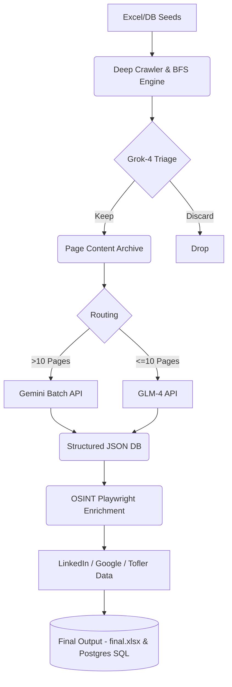

# DeepMine - AI Data Extraction Pipeline

DeepMine is an end-to-end B2B data intelligence software pipeline that automates the extraction and enrichment of company and product data from the web. It is capable of processing thousands of websites to build structured PostgreSQL databases using headless browsers and Large Language Models.

## Overview

The pipeline consists of three core subsystems:
1. **Deep Crawler**: A robots.txt-aware, breadth-first crawler built with `asyncio` that uses Grok-4-Fast structured outputs to triage links, deterministically finding relevant product, management, and infrastructure pages while dropping noise.
2. **Gemini Extractor**: A context-cached LLM extraction engine using Google's Gemini Batch API to enforce JSON Schema conformity on raw website data while slashing extraction costs.
3. **OSINT Enrichment Pipeline**: A Playwright-driven proxy-rotated scraper suite targeting Google, LinkedIn, and TheCompanyCheck to append hard-to-find data points like revenue and employee counts.
4. **Tofler Scraper**: An async Playwright orchestrator with 10 concurrent browser contexts designed to extract 10,000+ corporate directorship records robustly.

## Technology Stack

- **Core Engine:** Python 3.11+, `asyncio`, Pandas
- **Web Automation:** Playwright (Stealth mode, proxy rotation)
- **AI & LLMs:** 
  - Grok-4-Fast (Link Triage)
  - Gemini 2.0 Flash / Batch API (Structured Data Extraction + Context Caching)
  - GLM-4-Flash (Fast small-scale extraction)
- **Database:** PostgreSQL

## System Architecture



## Scale & Performance

In its latest run, DeepMine successfully extracted and structured:
- **9,200+** Companies
- **364,000+** Products
- **12,800+** Management/Directorship records
- **14,600+** Validated Indian Addresses

## Setup Instructions

1. Clone the repository
2. Install dependencies:
   ```bash
   pip install -r requirements.txt
   playwright install chromium
   ```
3. Set up environment variables by copying `.env.example` to `.env` and adding your provider keys.
4. Ensure a local PostgreSQL instance is running.

## Confidentiality Note

For security reasons, actual `.env` files, internal company datasets, and raw proxy credentials have been removed from this mirror.
