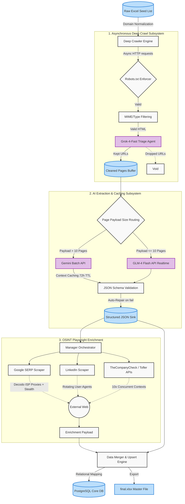

<div align="center">
  
# 🚀 DeepMine: Enterprise-Grade AI Data Extraction Pipeline

[](https://python.org)
[](https://playwright.dev/)
[](https://postgresql.org)
[](https://ai.google.dev/)
[](https://pandas.pydata.org)

**A high-performance, AI-driven OSINT and web scraping architecture designed to process thousands of corporate domains, utilizing Large Language Models (LLMs) to construct highly structured, deterministic business intelligence databases.**

</div>

---

## 🌟 Executive Summary

**DeepMine** is not just a scraper; it is a full-fledged data intelligence engine. It completely automates the pipeline from finding a company's URL to building a deep, multi-relational database of its products, infrastructure, and management team. By combining **robot-aware Breadth-First Search (BFS) crawling**, **proxy-rotated headless browser automation**, and **cutting-edge LLM context caching**, DeepMine achieves enterprise-level data extraction at a fraction of traditional API costs.

### 📈 Scale & Impact Metrics
In its latest production run, DeepMine autonomously processed and structured:
- **9,200+** Corporate Entities
- **364,000+** Unique Products & Services
- **12,800+** C-Suite & Management Records (via Tofler)
- **14,600+** Verified Geographical Addresses
- **7.8M+** web pages crawled and dynamically analyzed

---

## 🏗️ Advanced System Architecture

The pipeline is heavily distributed, utilizing asynchronous workers and multi-stage triage to ensure only high-value data reaches the expensive extraction layers.



---

## 🛠️ Core Engineering Features

### 1. Dual-Path LLM Extraction Engine
To massively reduce operational costs, the system routes extraction tasks dynamically:
- **Massive sites (10+ pages)**: Sent to **Gemini Batch API**. We utilize Gemini's Context Caching (72-hour TTL) to process thousands of tokens for pennies, enforcing strict JSON Schema compliance.
- **Micro-sites (<=10 pages)**: Sent directly to **GLM-4-Flash** for real-time extraction, bypassing the 24-hour SLA of batch processing.

### 2. AI-Driven Link Triage (Grok-4)
Instead of blindly traversing domains and accumulating noise, DeepMine feeds a domain's homepage link tree to **Grok-4-Fast**. The model acts as a highly intelligent heuristic agent, deterministically selecting only links related to products, services, contact info, and management, slashing subsequent crawl volume by 80%.

### 3. Asynchronous Playwright OSINT Suite
The enrichment suite handles extreme anti-bot environments (LinkedIn, Tofler, Google Maps) using:
- **Decodo ISP Residential Proxies** with aggressive rotation logic.
- **Concurrent Contexts**: Utilizing up to 10 isolated `asyncio` browser contexts simultaneously.
- **Playwright Stealth**: Evading modern canvas fingerprinting, headless detection, and WebDriver flags.

### 4. Robust Database Upserts
The Data Merger assigns unique provenance hashes to extracted data, gracefully handling deduplication, merging LLM outputs with scraped JSON-LD schema data, and performing bulk PostgreSQL `UPSERT` operations.

---

## 💻 Tech Stack Deep Dive

| Component | Technology | Role |
|-----------|------------|------|
| **Language** | Python 3.11+ | Core engine, concurrency (`asyncio`) |
| **Parsing** | BeautifulSoup4, Playwright | DOM parsing, JavaScript rendering, Bot evasion |
| **Intelligence** | Gemini 2.0, Grok-4, GLM-4 | Semantic triage, highly structured JSON extraction |
| **Data Layer** | PostgreSQL, Pandas | Relational integrity, high-speed CSV/Excel serialization |
| **Infra** | Tqdm, RotatingFileHandler | Advanced CLI progress tracking, log rotation |

---

## 🚀 Installation & Usage

1. **Clone the repository:**
   ```bash
   git clone https://github.com/7AI7/DeepMine.git
   cd DeepMine
   ```

2. **Install Python requirements:**
   *(Ensure you are using a virtual environment)*
   ```bash
   pip install -r deep_crawler/requirements.txt
   ```

3. **Install Browser Binaries:**
   Required for the Playwright enrichment pipelines.
   ```bash
   playwright install chromium
   ```

4. **Environment Configuration:**
   Copy the example environment file and populate it with your provider API keys and proxy credentials.
   ```bash
   cp .env.example .env
   ```

5. **Execution:**
   Initialize the orchestrator from either Excel seeds or the PostgreSQL connector.
   ```bash
   python deep_crawler/orchestrator.py --mode complete
   ```

---
*Developed by JAI J — AI Applications & Automation Engineer*
